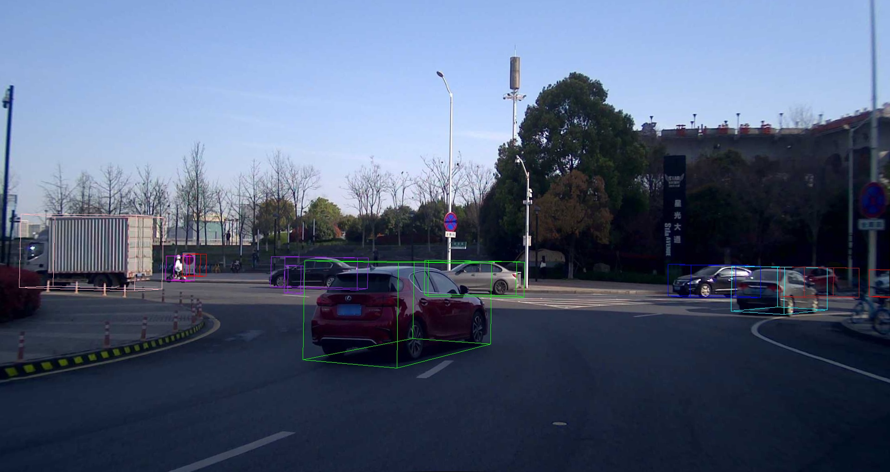
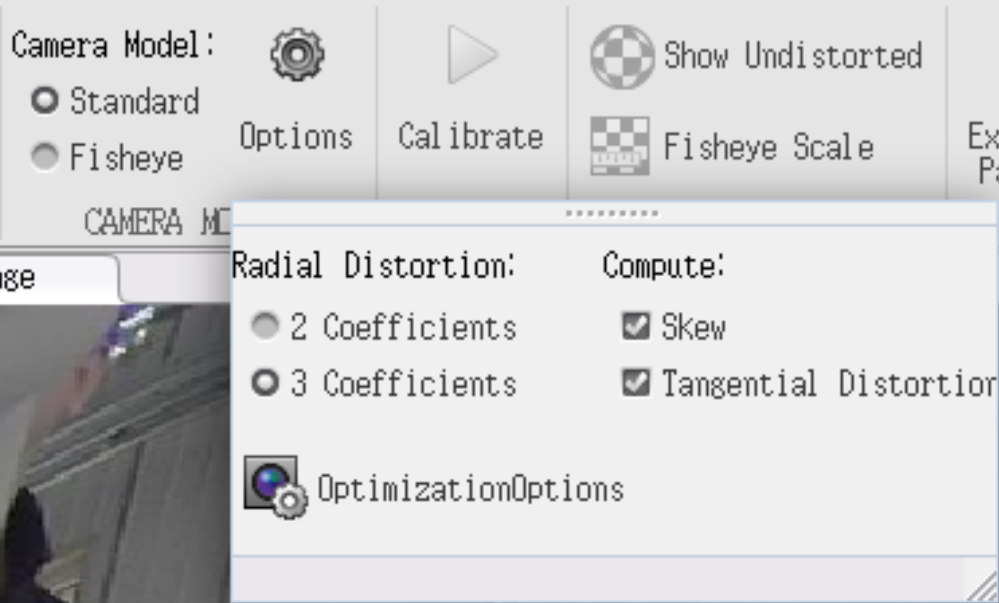

# NoobCalibration
## 标定方法简介
该标定方法是在`像素坐标系(2D点)`与`3D点云坐标系(3D点)`中选取若干组对应的点对，在已经标定出相机内参以及畸变参数的前提下，使用求解PnP（求解3D到2D点的对应方法）来计算出相机的外参。
#
## 软件环境
- cmake 3.16.3
- opencv 4.2.0
- jsoncpp 1.7.4
#
## 编译
```shell
cd {NoobCalibration_path}
mkdir build
cd build
cmake ..
make
```
完成编译后生成的可执行文件位于``{NoobCalibration_path}/bin``目录下
#
## 测试（有点啰嗦，建议跳过这一部分）
测试的数据位于``{NoobCalibration_path}/data``目录下
```
data
├─boxes_bat3d.json   bat3d格式的标注框文件，未使用可忽略
├─boxes.json         ONCE数据集中的标注转换为bat3d风格的标注框文件，实际是在激光雷达坐标系下的标注，用于测试时目标框的绘制
├─origin.json        ONCE数据集中的原始相机内外参文件，可用于与我们的标定结果进行对比
├─points.json        在ONCE数据集选择的点对文件，用于测试时的外参计算
├─test.jpg           ONCE数据集中的相机图像，用于测试时目标框的绘制
├─test.json          使用ONCE数据集的原始相机内参以及我们的外参标定结果文件
└─test.pcd           ONCE数据集中的点云文件，未使用可忽略
```
### 外参计算
```shell
cd {NoobCalibration_path}
./bin/PnP ./data/points.json ./data/test.json ./data/test.json
```
外参计算结果会被打印并保存至``./data/test.json``中
### 计算结果投影对比
```shell
cd {NoobCalibration_path}
#我们的标定结果
./bin/test ./data/test.jpg ./data/test.json ./data/test.json ./data/boxes.json
```



```shell
#ONCE数据集原始相机内外参
cd {NoobCalibration_path}
./bin/test ./data/test.jpg ./data/origin.json ./data/origin.json ./data/boxes.json
```


结合计算结果以及投影结果，可以看到该方法计算的外参结果与ONCE数据集给定的外参相差较小，平移差距17cm（平移向量之间的距离），旋转差距0.29度（三个方向的旋转差距之和），并且投影结果也相差较小，可以认为该标定方法在ONCE数据集的表现还不错。
#
## 参数说明
```
标定参数文件，可以参考{NoobCalibration_path}/data/test.json
{
   "channel" : 无意义,
   "modality" : 传感器自身类型,
   "image_size" : 图像大小 [w,h]，其中w代表图像的宽，h代表图像的高,
   "intrinsic" : 内参矩阵 [fx,skew,u0,0,fy,v0,0,0,1]，其中fx、fy代表焦距，u0、v0代表图像的中心像素坐标和图像原点像素坐标之间相差的横向和纵向像素数，skew代表扭曲参数,
   "distortion" : 畸变参数 [k1,k2,k3,p1,p2] 或 [k1,k2,p1,p2]，其中k代表径向畸变，p代表切向畸变,
   "undistort_intrinsic" : 去畸变后的内参矩阵，可由 内参矩阵 与 畸变参数 生成 [fx,skew,u0,0,fy,v0,0,0,1],
   "rotation" : 旋转矩阵，表示该传感器在目标的坐标系下的旋转，可以使用cv::Rodrigues(rotation,xyz)（c++）或scipy.spatial.transform.Rotation.from_matrix(rotation).as_euler("xyz")（python）将旋转矩阵变换成旋转向量,
   "translation" : 平移向量，表示该传感器在目标的坐标系下的平移 [x,y,z],
   "target" : 平移和旋转相对的目标,
}
```
```
点对文件，可以参考{NoobCalibration_path}/data/points.json
{
    "target_points" : 点云坐标系下点的坐标，注意顺序要与像素坐标系下点的坐标对应，
    [
        [x1,y1,z1],
        [x2,y2,z2],
        ...
        [xn,yn,zn]     
    ],
    "pixel_points" : 像素坐标系下点的坐标，注意顺序要与点云坐标系下点的坐标对应
    [
        [u1,v1],
        [u2,v2],
        ...
        [un,vn]
    ]
}
```
#
## 标定流程
### 数据采集
1. 内参数据采集。

2. 外参数据采集，需要同时采集``相机图像``与对应位置``激光雷达点云``数据，保证两者的视野中都能分辨出一个明显的目标，建议选择举起标定板在传感器的``不同角度、不同位置``进行录制，因为标定板中的棋盘格角点在近距离时可以在图像以及点云中清晰地观察到，而且即使到了远距离，标定板的边缘也能在图像以及点云中观察到，这样的话便于后续的外参标定。

### 内参标定
内参标定方法比较多，这里不再赘述，建议使用``Matlab``中``Camera Calibrator``来标定相机内参，标定时建议选择3个径向畸变参数，并勾选扭曲参数和切向畸变参数。



内参标定完成后，将标定结果手动填入``标定参数文件``中的``"image_size"``，``"intrinsic"``，``"distortion"``字段中，具体填写方法参考上文的``参数说明``。
### 外参标定
1. 首先浏览录制的外参数据中的相机图像，选择``图像清晰``的一帧数据。


2. 然后使用[``CloudCompare``](https://github.com/CloudCompare/CloudCompare)浏览``步骤1``中对应点云数据，检查在点云和图像中是否都能找到一个明显的``物体边界点``或者``棋盘格角点``，可以的话则使用``选点``功能选择对应的点，并将其记录在``点对文件``中的``"target_points"``字段。


3. 使用编译好的``get_pixel``工具选择在图像中与``步骤2``中选择的点对应的像素点。
```shell
cd {NoobCalibration_path}
./bin/get_pixel {图像路径}
```
启动之后在打开的图像窗口中，用鼠标缓慢移动同时观察放大的图像中准心的位置，当准心位置在与步骤2中选择的点对应的像素点上时，单击鼠标左键，在终端中则会打印该像素点的坐标[u,v]，并将其记录在``点对文件``中的``"pixel_points"``字段。


4. 重复``步骤1、2、3``，至少选择``4对``以上的点对，确保有足够多的点对来进行PnP的计算。

5. 计算PnP
```shell
cd {NoobCalibration_path}
./bin/PnP {点对文件路径} {标定参数文件路径}
#或
./bin/PnP {点对文件路径} {标定参数文件路径} {标定参数文件路径}
```
第二个参数``{标定参数文件路径}``仅使用了文件中的内参以及畸变参数；当带有第三个参数``{标定参数文件路径}``时，会将文件中的外参作为初值进行PnP计算，并且会将相机到激光雷达的外参计算结果更新保存到文件中；而不带有第三个参数时则不会保存外参计算结果。

6. 标定完成

#
## 关于结果的验证
可以使用[SensorsCalibration](https://github.com/PJLab-ADG/SensorsCalibration)中``lidar2camera/manual_calib``模块，根据标定结果将同一帧点云投影到图像上，查看点云是否和图像吻合以进行验证。

需要注意的是``lidar2camera/manual_calib``中默认使用的是激光雷达到相机的外参，我们默认保存的外参标定结果时相机到激光雷达的外参，因此需要将其组合成外参矩阵，然后计算其逆矩阵作为``lidar2camera/manual_calib``的外参输入。
## 关于点对的数量
PnP计算最少需要的点对数量为4，这也是为什么要求至少选择``4对``以上的点对，虽然在测试数据上我们仅选择了6对点对，但是在实际标定过程中建议选择10到20对``分布在图像中不同位置、在点云中不同距离``的点对，这样的话在计算PnP后可以删掉重投影误差较大的点。
## 关于重投影误差
重投影误差是根据外参的计算结果与标定出的相机内参矩阵，与点对中的3D点进行运算得到新的2D点（重投影），将重投影的点与原本点对中的2D点进行比较的结果；

注意该重投影误差只代表``外参的计算结果``与``选取的点对中各个点``的关系，和外参与实际值的误差没有直接联系，因此该重投影误差仅供参考。
## 关于外参与实际值的误差
目前该标定工具还不太成熟，基本上是处于一边验证一边标定的状态，使用ONCE数据集测试标定方法时，我们的标定结果与ONCE数据集自带的外参相比，传感器的平移差距17cm（平移向量之间的距离），旋转差距0.29度（三个方向的旋转差距之和），可以认为这个效果还是不错的。

但是当使用我们自己的数据进行标定方法时，总感觉误差比较大，但是由于我们没有外参的真值，因此目前的做法是将整个点云根据标定结果投影到图像中，查看点云是否与图像吻合，而没法得到一个量化的评价指标；并且造成误差较大的原因可能来自多个方面，例如内参、畸变、点对的选择等等。

针对上述问题，我们也在继续摸索改进标定方案，如果对目前的标定结果不太满意，可以使用[SensorsCalibration](https://github.com/PJLab-ADG/SensorsCalibration)中``lidar2camera/manual_calib``模块对标定结果进行手动调整。