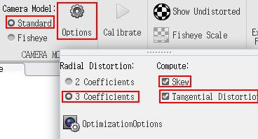
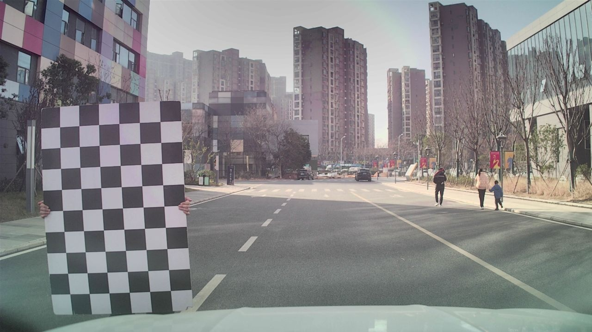
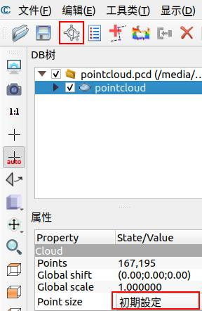
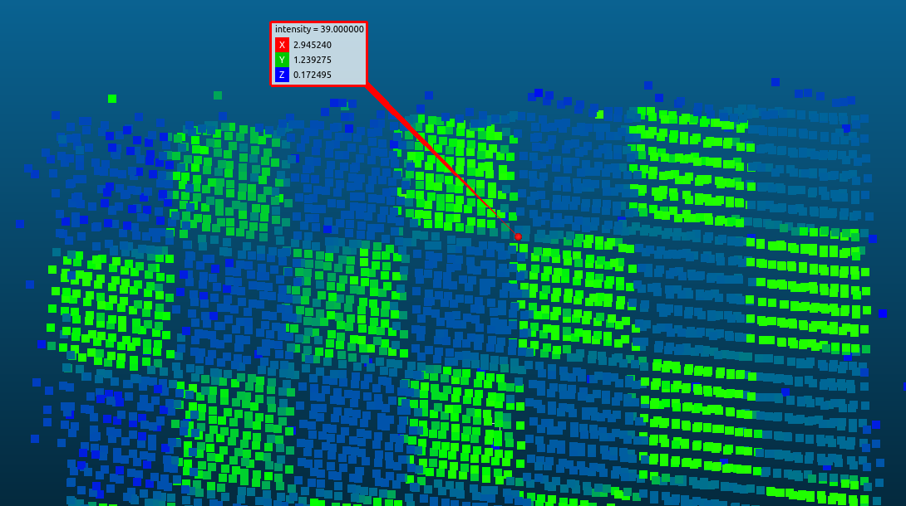
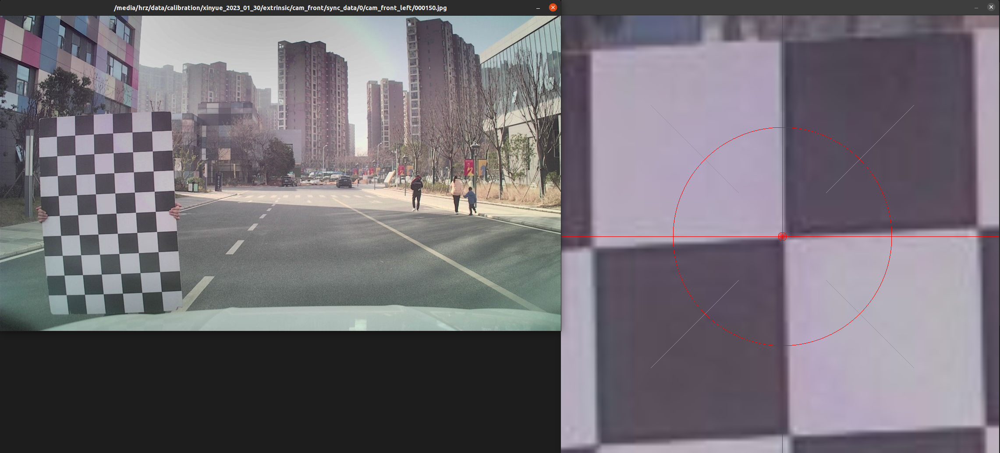

# NoobCalibration

一个适用于标定相机到激光雷达的外参的简易工具，标定数据需要同时录制`相机图片`和`激光雷达点云`，标定过程中需要手动在`相机图片`以及`激光雷达点云`中选取若干对点对，在已经标定出相机内参的前提下，使用选择的点对进行外参计算。

#
## 标定方法简介

该标定方法是在`像素坐标系(2D点)`与`3D点云坐标系(3D点)`中选取若干组对应的点对，在已经标定出相机内参以及畸变参数的前提下，使用求解PnP（求解3D到2D点的对应方法）来计算出相机的外参。

#
## 软件环境

- cmake 3.16.3
- opencv 4.2.0

#
## 目录结构

```
NoobCalibration
├─.vscode           vscode配置文件，可供debug时参考
├─data              测试用例
├─docs              使用及说明文档中的图片
├─include           头文件
├─script            一些方便使用的脚本，可供使用时参考
├─src               源文件
├─.gitignore        gitignore配置文件
├─CMakeLists.txt    CmakeLists配置文件
└─README.md         使用及说明文档
```

#
## 编译

```shell
cd {NoobCalibration_path}
mkdir build
cd build
cmake ..
make
```

完成编译后生成的可执行文件位于`{NoobCalibration_path}/bin`目录下

#
## 参数说明

```
标定参数文件，可以参考{NoobCalibration_path}/data/calibration.json
{
   "channel" : 无意义,
   "modality" : 传感器自身类型,
   "image_size" : 图像大小 [w,h]，其中w代表图像的宽，h代表图像的高,
   "intrinsic" : 内参矩阵 [f/dx,skew,u0,0,f/dy,v0,0,0,1]，其中fx、fy代表使用像素来描述x轴、y轴方向焦距的长度，u0、v0代表光心（相机坐标系原点）在像素坐标系的像素坐标，skew代表扭曲参数,
   "distortion" : 畸变参数 [k1,k2,p1,p2[,k3]]，其中k代表径向畸变，p代表切向畸变,
   "undistort_intrinsic" : 去畸变后的图像再次标定的内参矩阵 [f/dx,skew,u0,0,f/dy,v0,0,0,1],
   "undistort_distortion" : 去畸变后的图像再次标定的畸变参数 [k1,k2,p1,p2[,k3]]，其中k代表径向畸变，p代表切向畸变,
   "target" : 平移和旋转相对的目标,
   "rotation" : 旋转矩阵，表示该传感器在目标的坐标系下的旋转，可以使用cv::Rodrigues(rotation,xyz)（c++）或scipy.spatial.transform.Rotation.from_matrix(rotation).as_euler("xyz")（python）将旋转矩阵变换成旋转向量,
   "translation" : 平移向量，表示该传感器在目标的坐标系下的平移 [x,y,z]
}
```

```
点对文件，可以参考{NoobCalibration_path}/data/points.json
{
    "target_points" : 点云坐标系下点的坐标，注意顺序要与像素坐标系下点的坐标对应，
    [
        [x1,y1,z1],
        [x2,y2,z2],
        ...
        [xn,yn,zn]     
    ],
    "pixel_points" : 像素坐标系下点的坐标，注意顺序要与点云坐标系下点的坐标对应
    [
        [u1,v1],
        [u2,v2],
        ...
        [un,vn]
    ]
}
```

#
## 标定流程

主要分为数据采集、内参标定、外参标定三个部分。

## 1、数据采集

1. 内参数据采集：使用二维方格组成的标定板进行标定，采集`标定板不同位姿`的`相机图像`，尽可能多采集一些以便于后续图像去畸变后的再次标定。

2. 外参数据采集：需要同时采集`相机图像`与对应位置`激光雷达点云`数据，保证两者的视野中都能分辨出一个明显的目标，可以选择举起标定板在传感器的`不同角度、不同位置`进行录制，因为标定板中的棋盘格角点在近距离时可以在图像以及点云中清晰地观察到，而且即使到了远距离，标定板的边缘也能在图像以及点云中观察到，这样的话便于后续的外参标定。

由于采集的外参数据使用了相机和激光雷达两种传感器，因此需要注意`相机图像`和`激光雷达点云`数据的时间戳同步问题，尽可能使同一帧数据中`相机图像`和`激光雷达点云`的时间间隔较小（如果采用`ros`进行通信，在解包时请使用sensor_msgs.msg.header.stamp作为时间戳，而非rosbag记录到的时间戳）。

## 2、内参标定

1. 初次内参标定：使用采集的内参图像数据，进行内参标定，内参标定完成后，将标定结果手动填入`标定参数文件`中的`"image_size"`，`"intrinsic"`，`"distortion"`字段中，具体填写方法参考上文的`参数说明`。

2. 去畸变后的图像再次内参标定：使用第一次内参标定的结果，对采集的内参图像进行去畸变处理后，再次进行内参标定，将标定结果手动填入`标定参数文件`中的`"undistort_intrinsic"`，`"undistort_distortion"`字段中，具体填写方法参考上文的`参数说明`。

内参标定方法比较多，这里不再赘述，建议使用`Matlab`中`Camera Calibrator`来标定相机内参，标定时建议选择3个径向畸变参数，并勾选扭曲参数和切向畸变参数，并尽可能筛选图片使最大重投影在0.45个像素以内。

<br></br>

图像去畸变的方法与选项也比较多，这里提供了一个图像去畸变的脚本供参考使用。

```shell
cd {NoobCalibration_path}
python3 ./script/undistort.py {原始图像目录路径} {输出去畸变图像目录路径} {标定参数文件路径}
```

## 3、外参标定

1. 首先浏览录制的外参数据中的相机图像，选择`图像清晰`的一帧数据。

<br></br>

2. 然后使用[`CloudCompare`](https://github.com/CloudCompare/CloudCompare)浏览`步骤1`中对应点云数据，检查在点云和图像中是否都能找到一个明显的`物体边界点`或者`棋盘格角点`，可以的话则使用`选点`功能选择对应的点，并将其记录在`点对文件`中的`"target_points"`字段。


<br></br>

3. 使用编译好的`get_pixel`工具选择在`去畸变后的图像`中与`步骤2`中选择的点对应的像素点。

```shell
cd {NoobCalibration_path}
./bin/get_pixel {图像路径}
#或
./bin/get_pixel {图像路径} {标定参数文件路径}
```

* 第二个参数`{标定参数文件路径}`使用了`标定参数文件`中的`"intrinsic"`字段以及`"distortion`字段来对图像进行去畸变处理，如果输入的图像已经经过去畸变处理，则不应该输入此参数。

* 启动之后在打开的图像窗口中，用鼠标缓慢移动同时观察放大的图像中准心的位置，当准心位置在与步骤2中选择的点对应的像素点上时，单击鼠标左键，在终端中则会打印该像素点的坐标[u,v]，并将其记录在`点对文件`中的`"pixel_points"`字段。

<br></br>

4. 重复`步骤1、2、3`，至少选择`4对`以上的点对，确保有足够多的点对来进行PnP的计算。

5. 计算PnP

```shell
cd {NoobCalibration_path}
./bin/PnP {点对文件路径} {标定参数文件路径}
#或
./bin/PnP {点对文件路径} {标定参数文件路径} {标定参数文件路径}
```

* 第二个参数`{标定参数文件路径}`仅使用了文件中的内参以及畸变参数；

* 带有第三个参数`{标定参数文件路径}`时，会将文件中的外参作为初值（可为空）进行PnP计算，并且会将相机到激光雷达的外参计算结果更新保存到文件中；而不带有第三个参数时则不会保存外参计算结果。

6. 标定完成

<br></br>

#
## 关于结果的验证

可以使用[SensorsCalibration](https://github.com/PJLab-ADG/SensorsCalibration)中`lidar2camera/manual_calib`模块，或者使用适配我们参数格式的[manual_calib](https://github.com/TankGewehr/manual_calib)修改版本，根据标定结果将同一帧点云投影到图像上，查看点云是否和图像吻合以进行验证。

需要注意的是`SensorsCalibration`中默认使用的是激光雷达到相机的外参，我们默认保存的外参标定结果时相机到激光雷达的外参，因此需要将其组合成外参矩阵，然后计算其逆矩阵作为外参输入，如果使用适配我们参数格式的`manual_calib`则不需要考虑这个问题。

## 关于点对的数量

PnP计算最少需要的点对数量为4，这也是为什么要求至少选择`4对`以上的点对，虽然在测试数据上我们仅选择了6对点对，但是在实际标定过程中建议选择10到20对`分布在图像中不同位置、在点云中不同距离`的点对，这样的话在计算PnP后可以删掉重投影误差较大的点。

## 关于重投影误差

重投影误差是根据外参的计算结果与标定出的相机内参矩阵，与点对中的3D点进行运算得到新的2D点（重投影），将重投影的点与原本点对中的2D点进行比较的结果；

注意该重投影误差只代表`外参的计算结果`与`选取的点对中各个点`的关系，和外参与实际值的误差没有直接联系，因此该重投影误差仅供参考。

## 关于外参与实际值的误差

目前该标定工具还不太成熟，基本上是处于一边验证一边标定的状态，使用ONCE数据集测试标定方法时，我们的标定结果与ONCE数据集自带的外参相比，传感器的平移差距17cm（平移向量之间的距离），旋转差距0.29度（三个方向的旋转差距之和），可以认为这个效果还是不错的。

但是当使用我们自己的数据进行标定方法时，总感觉误差比较大，但是由于我们没有外参的真值，因此目前的做法是将整个点云根据标定结果投影到图像中，查看点云是否与图像吻合，而没法得到一个量化的评价指标；并且造成误差较大的原因可能来自多个方面，例如内参、畸变、点对的选择等等。

针对上述问题，我们也在继续摸索改进标定方案，如果对目前的标定结果不太满意，可以使用[SensorsCalibration](https://github.com/PJLab-ADG/SensorsCalibration)中`lidar2camera/manual_calib`模块对标定结果进行手动调整。