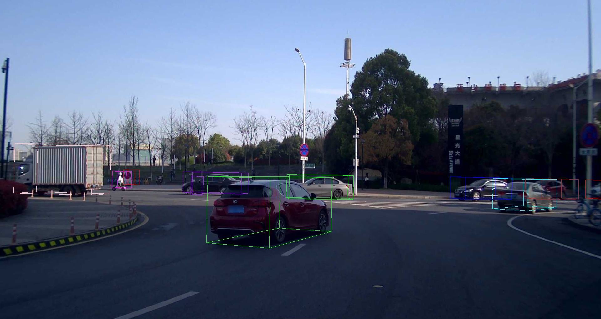

# NoobCalibration
## 在ONCE数据集上的测试
测试的数据位于`{NoobCalibration_path}/data`目录下
```
ONCE
├─boxes_bat3d.json   bat3d格式的标注框文件，未使用可忽略
├─boxes.json         ONCE数据集中的标注转换为bat3d风格的标注框文件，实际是在激光雷达坐标系下的标注，用于测试时目标框的绘制
├─origin.json        ONCE数据集中的原始相机内外参文件，可用于与我们的标定结果进行对比
├─points.json        在ONCE数据集选择的点对文件，用于测试时的外参计算
├─test.jpg           ONCE数据集中的相机图像，用于测试时目标框的绘制
├─test.json          使用ONCE数据集的原始相机内参以及我们的外参标定结果文件
└─test.pcd           ONCE数据集中的点云文件，未使用可忽略
```
### 外参计算
```shell
cd {NoobCalibration_path}
./bin/PnP ./data/points.json ./data/test.json ./data/test.json
```
外参计算结果会被打印并保存至`./data/test.json`中
### 计算结果投影对比
```shell
cd {NoobCalibration_path}
#我们的标定结果
./bin/test ./data/test.jpg ./data/test.json ./data/test.json ./data/boxes.json
```

<br></br>

```shell
#ONCE数据集原始相机内外参
cd {NoobCalibration_path}
./bin/test ./data/test.jpg ./data/origin.json ./data/origin.json ./data/boxes.json
```

<br></br>

结合计算结果以及投影结果，可以看到该方法计算的外参结果与ONCE数据集给定的外参相差较小，平移差距17cm（平移向量之间的距离），旋转差距0.29度（三个方向的旋转差距之和），并且投影结果也相差较小，可以认为该标定方法在ONCE数据集的表现还不错。